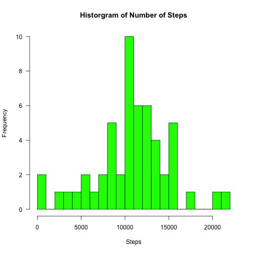
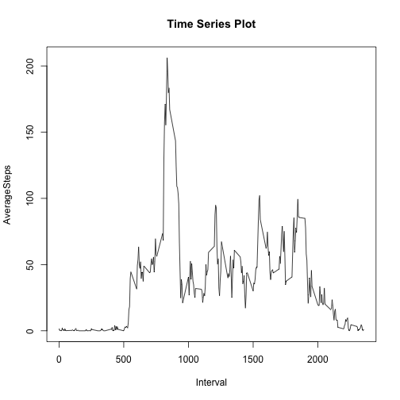
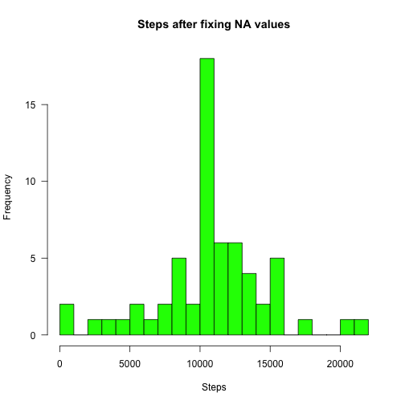
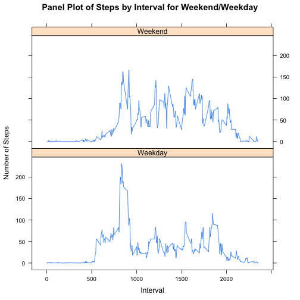

This is an R Markdown document. Markdown is a simple formatting syntax for authoring HTML, PDF, and MS Word documents. For more details on using R Markdown see <http://rmarkdown.rstudio.com>.

When you click the **Knit** button a document will be generated that includes both content as well as the output of any embedded R code chunks within the document. You can embed an R code chunk like this:

###Loading and preprocessing the data

Show any code that is needed to

1. Load the data (i.e. read.csv())

2. Process/transform the data (if necessary) into a format suitable for your analysis


```r
act <- read.csv("activity.csv", sep=",", header = TRUE, stringsAsFactors = FALSE)
str(act)
```

```
## 'data.frame':	17568 obs. of  3 variables:
##  $ steps   : int  NA NA NA NA NA NA NA NA NA NA ...
##  $ date    : chr  "2012-10-01" "2012-10-01" "2012-10-01" "2012-10-01" ...
##  $ interval: int  0 5 10 15 20 25 30 35 40 45 ...
```

```r
act$date1 <- as.Date(act$date, "%Y-%m-%d")
head(act)
```

```
##   steps       date interval      date1
## 1    NA 2012-10-01        0 2012-10-01
## 2    NA 2012-10-01        5 2012-10-01
## 3    NA 2012-10-01       10 2012-10-01
## 4    NA 2012-10-01       15 2012-10-01
## 5    NA 2012-10-01       20 2012-10-01
## 6    NA 2012-10-01       25 2012-10-01
```

###What is mean total number of steps taken per day?

For this part of the assignment, you can ignore the missing values in the dataset.

1. Calculate the total number of steps taken per day

2. If you do not understand the difference between a histogram and a barplot, research the difference between them. Make a histogram of the total number of steps taken each day

3. Calculate and report the mean and median of the total number of steps taken per day


```r
library(dplyr)
```

```
## 
## Attaching package: 'dplyr'
## 
## The following objects are masked from 'package:stats':
## 
##     filter, lag
## 
## The following objects are masked from 'package:base':
## 
##     intersect, setdiff, setequal, union
```

```r
#Calculation of total number of steps taken per day
df <- filter(act, is.na(act$steps) == FALSE)
dfSum <- dplyr::summarise(group_by(df, date1), sum(steps))
names(dfSum) <- c("Date", "TotSteps")
head(dfSum)
```

```
## Source: local data frame [6 x 2]
## 
##         Date TotSteps
##       (date)    (int)
## 1 2012-10-02      126
## 2 2012-10-03    11352
## 3 2012-10-04    12116
## 4 2012-10-05    13294
## 5 2012-10-06    15420
## 6 2012-10-07    11015
```

```r
#Displaying the data on histogram
hist(dfSum$TotSteps, breaks=30, main="Historgram of Number of Steps", xlab="Steps", col="green", las=1)
```

 

```r
#Calculating mean and median steps taken per day
library(plyr)
```

```
## -------------------------------------------------------------------------
## You have loaded plyr after dplyr - this is likely to cause problems.
## If you need functions from both plyr and dplyr, please load plyr first, then dplyr:
## library(plyr); library(dplyr)
## -------------------------------------------------------------------------
## 
## Attaching package: 'plyr'
## 
## The following objects are masked from 'package:dplyr':
## 
##     arrange, count, desc, failwith, id, mutate, rename, summarise,
##     summarize
```

```r
mean <- mean(df$steps)
median <- median(df$steps)
```

Mean and Median steps taken per day are 37.3825996 and 0 respectively.

###What is the average daily activity pattern?

1. Make a time series plot (i.e. type = "l") of the 5-minute interval (x-axis) and the average number of steps taken, averaged across all days (y-axis)

2. Which 5-minute interval, on average across all the days in the dataset, contains the maximum number of steps?


```r
#Time series plot
df <- filter(act, is.na(act$steps) == FALSE)
dfMean <- dplyr::summarise(group_by(df, interval), mean(steps))
names(dfMean) <- c("Interval", "AverageSteps")
with(dfMean, {plot(Interval, AverageSteps, type="l", main="Time Series Plot")})
```

 

```r
#Sorting the data in descending order and selecting the 1st record to idntify the 5-minute average interval with max steps
arrange(dfMean, desc(AverageSteps))[1,]
```

```
## Source: local data frame [1 x 2]
## 
##   Interval AverageSteps
##      (int)        (dbl)
## 1      835     206.1698
```

###Imputing missing values

Note that there are a number of days/intervals where there are missing values (coded as NA). The presence of missing days may introduce bias into some calculations or summaries of the data.

1. Calculate and report the total number of missing values in the dataset (i.e. the total number of rows with NAs)

2. Devise a strategy for filling in all of the missing values in the dataset. The strategy does not need to be sophisticated. For example, you could use the mean/median for that day, or the mean for that 5-minute interval, etc.

3. Create a new dataset that is equal to the original dataset but with the missing data filled in.

4. Make a histogram of the total number of steps taken each day and Calculate and report the mean and median total number of steps taken per day. Do these values differ from the estimates from the first part of the assignment? What is the impact of imputing missing data on the estimates of the total daily number of steps?


```r
#Counting total number of missing values
nrow(filter(act,is.na(steps)==TRUE))
```

```
## [1] 2304
```

```r
#applying a strategy to fill the missing values with the average steps taken for that interval using dfMean calculated earlier
act1 <- filter(act, is.na(steps) == TRUE)
dfMerge <- merge(act1, dfMean, by.x="interval", by.y="Interval", all=TRUE)[,c("AverageSteps", "date", "interval", "date1")]
names(dfMerge) <- c("steps", "date", "interval", "date1")
dfMerge$steps <- trunc(dfMerge$steps)
#Creating the new dataset and checking the counts
dfBind <- rbind(filter(act, is.na(steps)==FALSE), dfMerge)

nrow(act) 
```

```
## [1] 17568
```

```r
nrow(dfMerge) 
```

```
## [1] 2304
```

```r
nrow(filter(dfMerge, is.na(steps)==TRUE)) 
```

```
## [1] 0
```

```r
#Calculating the Total, Mean and Median after fixing the missing data values
dfAll <- ddply(dfBind, .(date1), summarize, "tot"=sum(steps), "mean"=mean(steps), "median"=median(steps))
head(dfAll)
```

```
##        date1   tot     mean median
## 1 2012-10-01 10641 36.94792   33.5
## 2 2012-10-02   126  0.43750    0.0
## 3 2012-10-03 11352 39.41667    0.0
## 4 2012-10-04 12116 42.06944    0.0
## 5 2012-10-05 13294 46.15972    0.0
## 6 2012-10-06 15420 53.54167    0.0
```

```r
#Historgram
hist(dfAll$tot, breaks=30, main="Steps after fixing NA values", xlab="Steps", col="green", las=1)
```

 

```r
hist(dfSum$TotSteps, breaks=30, main="Steps before fixing NA values", xlab="Steps", col="green", las=1)
```

 

```r
#Conclusion: 
#(a) Total number of steps for certain days has drastrically went up. This due to non-availability of steps taken for certain days (b) Median for certain days has gone up from 0 which can be clearly noticed when comparing the values before & after fixing the data (c) There is not much of change in Mean for the days where median has been 0 before & after fixing the data which also demonstrates the quality of data collection
```

###Are there differences in activity patterns between weekdays and weekends?

For this part the weekdays() function may be of some help here. Use the dataset with the filled-in missing values for this part.

1. Create a new factor variable in the dataset with two levels – “weekday” and “weekend” indicating whether a given date is a weekday or weekend day.

2. Make a panel plot containing a time series plot (i.e. type = "l") of the 5-minute interval (x-axis) and the average number of steps taken, averaged across all weekday days or weekend days (y-axis). See the README file in the GitHub repository to see an example of what this plot should look like using simulated data.


```r
#Adding new variables for Day and Weekday/Weekend indicator
dfBind$Day <- weekdays(dfBind$date1)
dfBind$WDay <- ifelse (weekdays(dfBind$date1) %in% c("Saturday", "Sunday"), "Weekend", "Weekday")
dfFinalGrp <- dplyr::summarize(group_by(dfBind, interval, WDay), mean(steps))
names(dfFinalGrp) <- c("Interval","WDay", "Steps")
head(dfFinalGrp)
```

```
## Source: local data frame [6 x 3]
## 
##   Interval    WDay     Steps
##      (int)   (chr)     (dbl)
## 1        0 Weekday 2.1555556
## 2        0 Weekend 0.1250000
## 3        5 Weekday 0.4000000
## 4        5 Weekend 0.0000000
## 5       10 Weekday 0.1555556
## 6       10 Weekend 0.0000000
```

```r
#plot created using lattice library
library(lattice)
attach(dfFinalGrp)
days.f <- factor(dfFinalGrp$WDay, levels=c("Weekday", "Weekend"), labels=c("Weekday", "Weekend"))
xyplot(dfFinalGrp$Steps~dfFinalGrp$Interval|days.f, 
        main="Panel Plot of Steps by Interval for Weekend/Weekday", 
        ylab="Number of Steps", xlab="Interval", type="l", layout=c(1,2))
```

 
